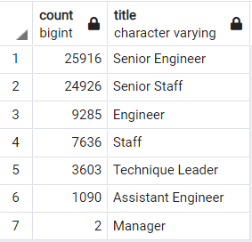
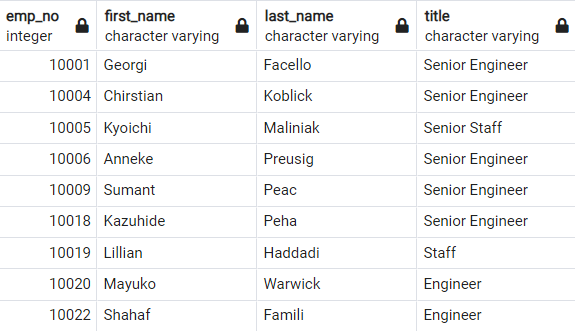
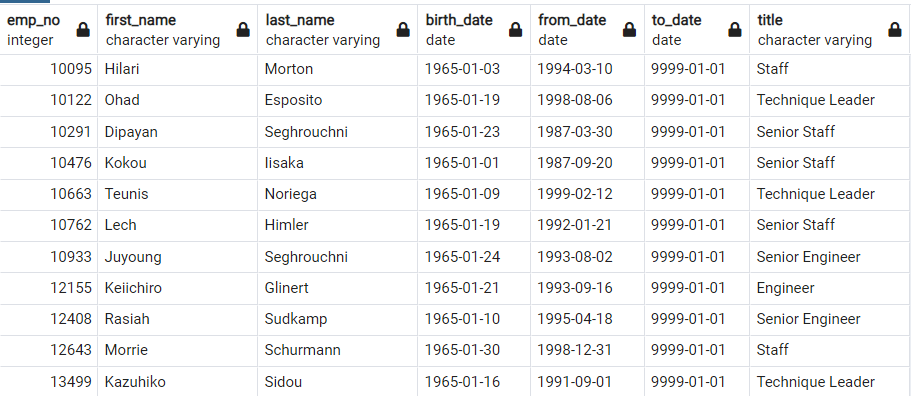

# Pewlett-Hackard-Analysis
## Overview of the project

This project is dedicated to build an Employee Database with SQL, where we'll be applying the next skills:
 * Create database designs or Entity Relationships Diagrams (ERD).
 * Design and manage tables
 * Write basic to intermediate SQL statements.

## Results

1. Number of Retiring Employees by Title

The following Titles table shows employees who are born between January 1, 1952 and December 31, 1955 so whom are elegible to retire in the next years:

A complete list of employees by name and current title is provided on the Data folder of this repository:

2. Employees Eligible for the Mentorship Program.

Managers from sales and developement departments want to introduce a mentorship program where experienced and successful employees stepping back into a part-time role instead of retiring completely. Their new role in the company would be as a mentor to the newly hired folks. The first list of candidates for this program are listed on this repository' Data folder. Whe found a total of 1,549 employees elegibles. 

## Summary

A total of 72,458 eployees are elegible to retire in the next years where 70% of this are Enginners and Staff with a Senior level.

Acording to the requirements for the mentorship program we found a total of 1,549 elegible employees. So in adition to the required list we can see in the followong tables a sumary per department name and job titles: 

